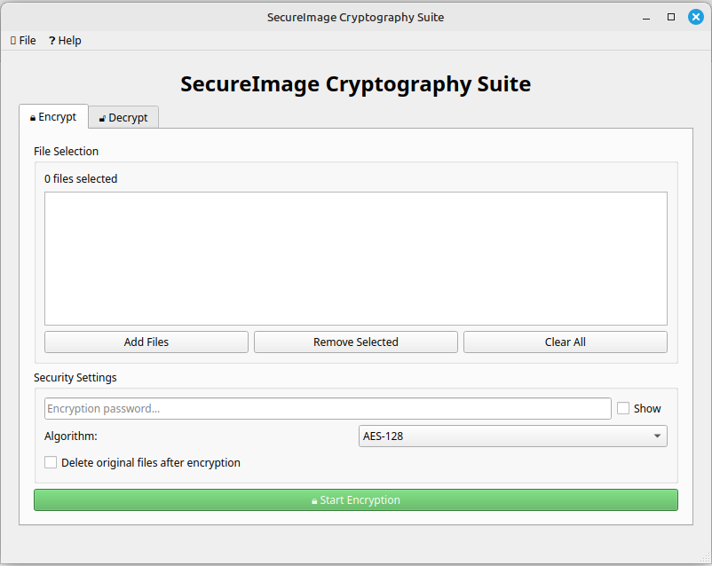
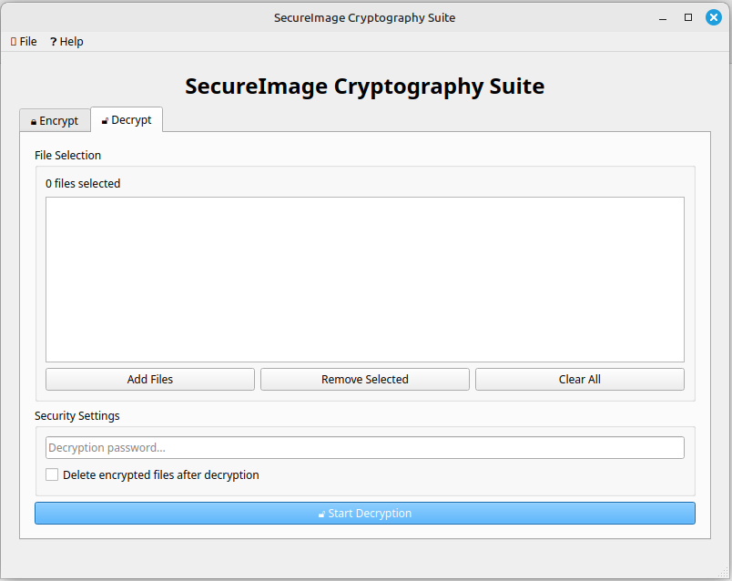

Here’s a detailed **About** section that you can include in your `README.md` file to describe the application, its features, and how to use it:

---

# SecureImage Cryptography Suite

**SecureImage Cryptography Suite** is a secure and user-friendly desktop application designed to encrypt and decrypt image files using the AES (Advanced Encryption Standard) algorithm. It provides military-grade encryption to protect your sensitive images and supports batch processing for multiple files at once. The application is built with PyQt5 for the graphical user interface and uses the `pycryptodome` library for cryptographic operations.

---

## Features

- **Multi-File Support**: Encrypt or decrypt multiple files simultaneously.
- **AES Encryption**: Supports AES-128, AES-192, and AES-256 encryption standards.
- **Drag-and-Drop Interface**: Easily add files by dragging and dropping them into the application.
- **Password Protection**: Securely encrypt files with a user-defined password using PBKDF2 key derivation.
- **Batch Processing**: Process multiple files in one go with progress tracking.
- **File Management Options**:
  - Delete original files after encryption.
  - Delete encrypted files after decryption.
- **User-Friendly Interface**: Intuitive design with clear instructions and error messages.
- **Cross-Platform**: Works on Windows, macOS, and Linux.

---

## Installation

### Prerequisites
- Python 3.7 or higher
- `pycryptodome` library for cryptographic operations
- `PyQt5` for the graphical user interface

### Steps
1. Clone the repository:
   ```bash
   git clone https://github.com/K-Lakshan/Image-Encryption.git
   cd Image-Encryption
   ```

2. Install the required dependencies:
   ```bash
   pip install -r requirements.txt
   ```

3. Run the application:
   ```bash
   python main.py
   ```

---

## Usage

### Encryption
1. Open the application and navigate to the **Encrypt** tab.
2. Add image files (`.png`, `.jpg`, `.jpeg`, `.bmp`) using the "Add Files" button or by dragging and dropping.
3. Enter a strong password for encryption.
4. Select the encryption algorithm (AES-128, AES-192, or AES-256).
5. Optionally, enable "Delete original files after encryption" to remove the original files after encryption.
6. Click **Start Encryption** to begin the process.

### Decryption
1. Open the application and navigate to the **Decrypt** tab.
2. Add encrypted files (`.enc`) using the "Add Files" button or by dragging and dropping.
3. Enter the decryption password.
4. Optionally, enable "Delete encrypted files after decryption" to remove the encrypted files after decryption.
5. Click **Start Decryption** to begin the process.

---

## Screenshots


*Encryption Tab: Add files, set password, and choose encryption strength.*


*Decryption Tab: Add encrypted files and enter the password.*

---

## Security Notes
- **Password Strength**: Use a strong, unique password for encryption. The application uses PBKDF2 with 1,000,000 iterations to derive the encryption key.
- **File Integrity**: Ensure that encrypted files are not modified, as this may result in decryption errors.
- **Data Loss**: Enabling the "Delete original files" or "Delete encrypted files" options is irreversible. Use with caution.

---


## License
This project is licensed under the **MIT License**. See the [LICENSE](LICENSE) file for details.

---


---

## Acknowledgments
- **PyQt5**: For the graphical user interface.
- **pycryptodome**: For cryptographic operations.
- **Open Source Community**: For inspiration and support.

---
